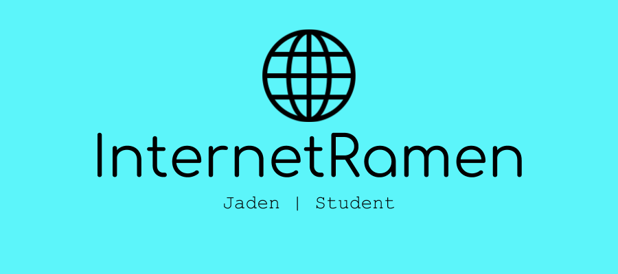
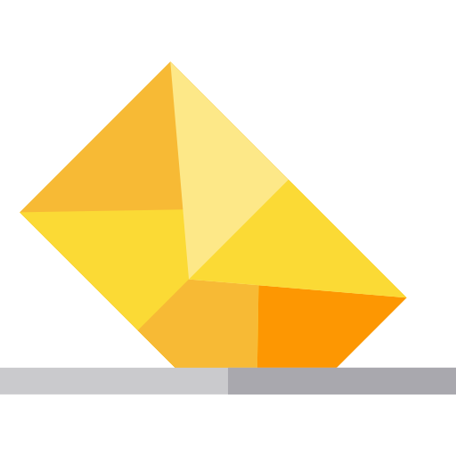

# Hello there!
My name is Jaden. I am a aspiring student developer attempting to get better.

## 🔭 I’m currently working on ...
 - Hacktoberfest
 - GitHub Profile Page

## 🌱 I’m currently learning ...
 - Mongoose (MongoDB)
 - Electron
 - Java
 - General Information about tech and protocols

## 👯 I’m looking to collaborate on ...
 - Discord Bots

 ## 📫 How to reach me: ...
 

## 📈 Stats ...
 

## 💻 Tech & Tools ...
   

---
Icon made by <a href="https://www.flaticon.com/authors/freepik" title="Freepik">Freepik</a> from <a href="https://www.flaticon.com/" title="Flaticon"> www.flaticon.com</a>